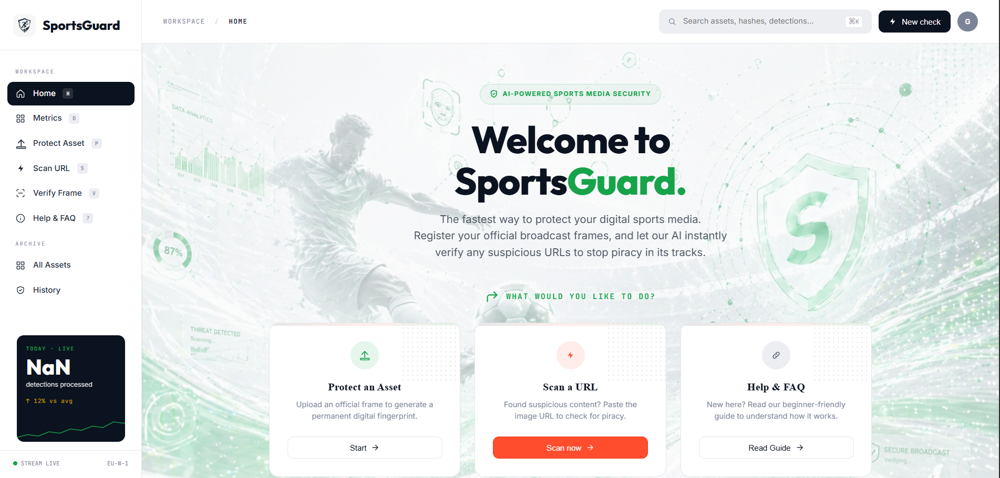

<div align="center">
  

  <h1>SportsGuard AI</h1>

  <p><strong>AI-powered media integrity for live sports broadcasters and rights holders.</strong></p>
  <p><em>Built on Google Cloud · Gemini · Cloud Vision · Cloud Run · Firestore</em></p>

  <p>
    <a href="https://sports-guard-ai.web.app">
      
    </a>
    <a href="https://sportsguard-api-712383807173.us-central1.run.app/health">
      
    </a>
    
  </p>

  <p>
    
    
    
    
    
    
    
    
    
    
  </p>
</div>

---

## The Problem

Live sports piracy is a multi-billion-dollar leak. The most valuable broadcast window is also when pirated clips spread fastest — across mirror sites, social platforms, and reupload forums.

For rights holders the bottleneck is not detection. It is **proof**:

- Manually downloading a suspect clip
- Comparing it frame-by-frame against an original
- Filling out a takedown form before the highlight goes cold

By the time a notice is filed, the pirated copy has already done its damage.

## The Solution

**SportsGuard AI is a Google Cloud–native workflow that takes a suspect URL and returns a verdict, an evidence report, and a DMCA draft — in seconds.**

1. Rights holder registers an official broadcast frame → SportsGuard computes a 64-bit dHash fingerprint, runs Cloud Vision safety check, and stores frame + metadata.
2. Operator submits a suspicious image URL → SSRF guard validates the URL, backend fetches the image, recomputes the dHash.
3. Hamming-distance search across all registered assets finds the best candidate match.
4. If similarity ≥ 80%, **Gemini 2.0 Flash** on Vertex AI performs multimodal visual adjudication comparing original vs suspected image.
5. A weighted score (`0.4 × dHash + 0.6 × Gemini`) classifies the result: **piracy ≥ 85% · review 70–84% · clean < 70%**.
6. One click exports the evidence report or generates a populated DMCA notice.

---

## Live Demo

| | URL |
|---|---|
| **Frontend** | https://sports-guard-ai.web.app |
| **Backend API Health Check** | https://sportsguard-api-712383807173.us-central1.run.app/health |

Sign in with Google or pick **Continue as Guest** to skip auth and try the full pipeline.

---

## Product Tour

### Sign-in — Google OAuth + Anonymous Guest Mode

<p align="center">
  
</p>

### Dashboard — Operator Workspace

<p align="center">
  
</p>

---

## Architecture

```
┌──────────────────────────────────────────────────────────────────┐
│                      Operator (Browser)                          │
│   React 18 + Vite ES Modules · Firebase Hosting (CDN)            │
│   Pages: Register · Check · Verify · Archive · Detection Log     │
└──────────────────────┬───────────────────────────────────────────┘
                       │ HTTPS · JSON
                       ▼
┌──────────────────────────────────────────────────────────────────┐
│                    Firebase Auth (OAuth + Anonymous)             │
│   Google Sign-In  ·  Guest mode  ·  ID-token verification        │
└──────────────────────┬───────────────────────────────────────────┘
                       │
                       ▼
┌──────────────────────────────────────────────────────────────────┐
│                  Backend API · Cloud Run (Node.js)               │
│   Express routes:  /register   /check   /verify   /detections    │
└──┬─────────────┬─────────────┬──────────────┬───────────────┬────┘
   │             │             │              │               │
   ▼             ▼             ▼              ▼               ▼
┌──────┐  ┌────────────┐  ┌──────────┐  ┌────────────┐  ┌──────────┐
│dHash │  │Cloud Vision│  │  Gemini  │  │  Firestore │  │   Cloud  │
│ 64-  │  │safeSearch  │  │   2.0    │  │  detections│  │  Storage │
│ bit  │  │ OCR·labels │  │  Flash   │  │   assets   │  │  frames  │
└──────┘  └────────────┘  └──────────┘  └────────────┘  └──────────┘
                          (Vertex AI)
 /register  /register        /register   /register      /register
            /verify          /check      /check         (read in
                                         /detections     /check)
```

**Detection pipeline inside `/check`:**

```
 ┌─────────────────────────────────────────────────────────────────────┐
 │                        /check  request                              │
 │                  { url: "https://suspect-site/…" }                  │
 └──────────────────────────────┬──────────────────────────────────────┘
                                │
                                ▼
                    ┌───────────────────────┐
                    │      SSRF  guard      │
                    │  assertSafePublicUrl  │  ← blocks localhost, RFC-1918,
                    └──────────┬────────────┘    metadata IPs, bad schemes
                                │
                                ▼
                    ┌───────────────────────┐
                    │   axios  download     │
                    │  (content-type check) │
                    └──────────┬────────────┘
                                │
                                ▼
                    ┌───────────────────────┐
                    │   dHash  64-bit       │
                    │  9 × 8 grayscale grid │
                    │  adjacent-pixel diff  │
                    └──────────┬────────────┘
                                │
                                ▼
                    ┌───────────────────────┐
                    │   Hamming  search     │
                    │  Firestore getAllAssets│
                    └──────────┬────────────┘
                                │
              ┌─────────────────┴──────────────────┐
              │ similarity < 80 %                   │ similarity ≥ 80 %
              ▼                                     ▼
       ╔══════════════╗              ┌───────────────────────────┐
       ║  NO_MATCH    ║              │  Fetch original frame     │
       ║  verdict     ║              │  Cloud Storage  →  Buffer │
       ╚══════════════╝              └──────────────┬────────────┘
                                                    │
                                                    ▼
                                     ┌───────────────────────────┐
                                     │   Gemini 2.0 Flash        │
                                     │   Vertex AI               │
                                     │  analyzeImages(orig, sus) │
                                     └──────────────┬────────────┘
                                                    │
                                                    ▼
                                     ┌───────────────────────────┐
                                     │  Weighted score           │
                                     │  0.4 × dHash              │
                                     │  0.6 × Gemini             │
                                     └──────────────┬────────────┘
                                                    │
                         ┌──────────────────────────┼──────────────────────────┐
                         │  score ≥ 85 %            │  70 – 84 %              │  < 70 %
                         ▼                          ▼                          ▼
                   ╔══════════╗             ╔══════════════╗            ╔══════════╗
                   ║  PIRACY  ║             ║    REVIEW    ║            ║  CLEAN   ║
                   ╚═════┬════╝             ╚══════┬═══════╝            ╚══════════╝
                         │                         │
                         └────────────┬────────────┘
                                      ▼
                         ┌────────────────────────────┐
                         │  saveDetection()           │
                         │  Firestore  ·  audit log   │
                         └────────────────────────────┘
                                      │
                                      ▼
                         ┌────────────────────────────┐
                         │  Evidence report           │
                         │  + DMCA draft (if piracy)  │
                         └────────────────────────────┘
```

---

## Google Cloud Stack

| Service | Role in SportsGuard AI |
|---|---|
| **Gemini 2.0 Flash** *(Vertex AI)* | Multimodal similarity reasoning · image description on register · evidence narration |
| **Cloud Vision API** | Safety check on register (`safeSearch`) · OCR + label detection on verify |
| **Cloud Run** | Stateless Node.js API · auto-scales per request |
| **Cloud Firestore** | Asset registry · detection history · audit trail |
| **Cloud Storage** | Original broadcast frames · evidence artefacts |
| **Firebase Hosting** | React frontend · global CDN delivery |
| **Firebase Auth** | Google OAuth + anonymous guest sessions |

---

## Features

### Asset Registration
Upload an official broadcast frame. Cloud Vision runs a content safety check, then a 64-bit difference hash (dHash) is computed via 9×8 grayscale adjacent-pixel comparison. Gemini 2.0 Flash generates an image description. All three run in parallel before the asset is saved to Firestore + Cloud Storage. The dHash fingerprint survives JPEG recompression, cropping, brightness/contrast shifts, and minor watermark overlays.

### URL Piracy Detection
Paste any public image URL. Backend SSRF-guards the URL (`assertSafePublicUrl`), fetches the image, computes its dHash, runs Hamming-distance search across all registered assets in Firestore, then sends the best match (≥ 80% similarity) to Gemini 2.0 Flash on Vertex AI for multimodal adjudication. Cloud Vision is **not** called in this route.

### Frame Verification
Upload a frame to read its watermark and provenance signals. Cloud Vision OCR surfaces broadcaster overlays, timecodes, and copyright marks. The result either confirms a licensed broadcast feed or flags the source as unverified.

### Evidence Export & DMCA Drafts
Every detection produces a structured evidence report and, for confirmed piracy, a pre-populated DMCA takedown notice referencing the matched asset, similarity scores, and Gemini reasoning.

### Detection Log
Permanent record of every adjudicated URL — searchable, sortable, and exportable. Live polling keeps the dashboard in sync with new detections.

---

## Tech Stack

| Layer | Choice |
|---|---|
| **Frontend** | React 18 · Vite ES modules · Firebase Hosting |
| **Backend** | Node.js 20 · Express · Docker · Cloud Run |
| **AI / Vision** | Gemini 2.0 Flash on Vertex AI · Cloud Vision API |
| **Hashing** | 64-bit difference hash (dHash · 9×8 adjacent-pixel grid) |
| **Persistence** | Cloud Firestore (NoSQL) · Cloud Storage |
| **Auth** | Firebase Auth — Google OAuth + Anonymous |
| **CI / Build** | Vite · npm · `gcloud run deploy` |

---

## Local Setup

### Prerequisites
- Node.js 20+
- A Google Cloud project with **Vertex AI**, **Cloud Vision**, **Firestore**, **Cloud Storage**, and **Firebase Auth** enabled
- A Firebase web app config

### Frontend
```bash
cd frontend
npm install
npm run dev          # http://localhost:5173
```

Configure `frontend/.env`:
```
VITE_API_BASE=http://localhost:8080
VITE_FIREBASE_API_KEY=...
VITE_FIREBASE_AUTH_DOMAIN=...
VITE_FIREBASE_PROJECT_ID=...
VITE_FIREBASE_APP_ID=...
```

### Backend
```bash
cd backend
cp .env.example .env       # fill in GCP project + service-account creds
npm install
npm start                  # http://localhost:8080
```

### Deploy
```bash
# Backend → Cloud Run
gcloud run deploy sportsguard-api --source backend --region us-central1

# Frontend → Firebase Hosting
cd frontend && npm run build && firebase deploy --only hosting
```

---

## Testing

Both packages ship with executable test suites — no test framework dependency, just `node`.

### Frontend
```bash
cd frontend && npm test
```
Verifies the Vite migration is intact: `index.html` uses `type="module"` (no leftover `text/babel`), the landing page exposes primary actions, and `src/main.jsx` / `services/api.js` / `components/shell.jsx` keep the migrated module structure.

### Backend
```bash
cd backend && npm test
```
Five **SSRF guard** tests for the URL fetcher — the most security-critical surface, since `/check` downloads arbitrary user-supplied URLs:

| Test | What it verifies |
|---|---|
| Rejects unsupported protocols | Blocks `file://`, `gopher://`, etc. |
| Rejects localhost hostnames | Blocks `http://localhost:*` |
| Rejects cloud metadata targets | Blocks `169.254.169.254` (GCP / AWS metadata) |
| Accepts public IPs | Allows legitimate public targets |
| Classifies private address ranges | Catches `10.x`, `192.168.x`, `::1`, `127.x` |

### Build verification
```bash
cd frontend && npm run build       # Vite production build
```

---

## API Reference

| Method | Endpoint | Purpose |
|---|---|---|
| `POST` | `/register` | Register a broadcast frame · returns `phash`, `assetId` |
| `POST` | `/check`   | Scan a suspicious URL · returns verdict, scores, reasoning |
| `POST` | `/verify`  | OCR + watermark check on uploaded image |
| `GET`  | `/detections` | Paginated detection history |
| `GET`  | `/health` | Service health check |

---

## Project Structure

```
sports-guard-ai/
├── backend/
│   ├── src/
│   │   ├── index.js                    # Express bootstrap
│   │   ├── routes/                     # /register /check /verify /detections
│   │   └── modules/
│   │       ├── phash.js                # 64-bit dHash (9×8 adjacent-pixel diff)
│   │       ├── gemini.js               # Vertex AI · Gemini 2.0 Flash
│   │       ├── vision.js               # Cloud Vision OCR + logo
│   │       ├── firestore.js            # Asset & detection storage
│   │       ├── storage.js              # Cloud Storage uploads
│   │       └── urlSafety.js            # SSRF + content-type guard
│   └── Dockerfile                      # Cloud Run container
└── frontend/
    ├── src/
    │   ├── main.jsx                    # Root + auth gate
    │   ├── components/                 # Sidebar, Topbar, LoginPage
    │   ├── pages/                      # Landing, Dashboard, Register, Check, Verify, Archive
    │   └── services/                   # api.js, firebase-auth.js
    └── vite.config.js
```

---

## Solution Challenge 2026 Fit

| Criterion | How SportsGuard AI delivers |
|---|---|
| **Real Google Cloud usage** | Five GCP services in production · live URLs above |
| **Generative AI integration** | Gemini 2.0 Flash on Vertex AI as the verdict authority |
| **Track 1 — Digital Asset Protection** | End-to-end registration → detection → enforcement |
| **Working prototype** | Deployed, browsable, demo-ready right now |
| **Practical impact** | Compresses hours of manual proof collection into seconds |

---

<div align="center">
  <p><strong>Built by Team Hackwin for Solution Challenge 2026.</strong></p>
</div>
