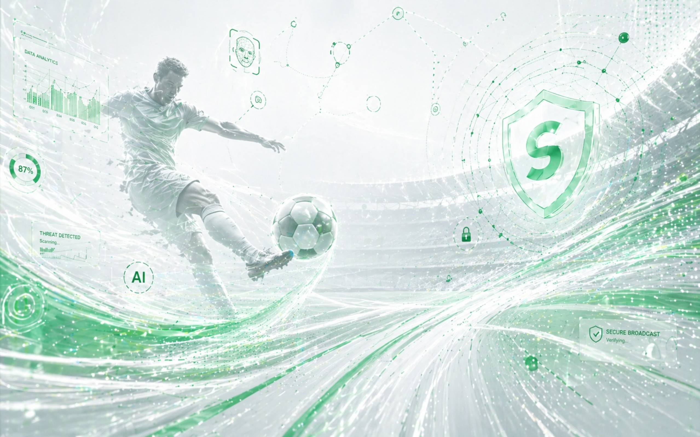

<div align="center">
  
  <h1>SportsGuard AI</h1>
  <p><strong>Digital asset protection for live sports media</strong></p>

  <a href="https://sports-guard-ai.web.app">
    
  </a>
  <a href="https://sportsguard-api-712383807173.us-central1.run.app/health">
    
  </a>
  
  
  
  
  
  
</div>

<br />

## Live Deployment

- Frontend: [https://sports-guard-ai.web.app](https://sports-guard-ai.web.app)
- Backend API health: [https://sportsguard-api-712383807173.us-central1.run.app/health](https://sportsguard-api-712383807173.us-central1.run.app/health)

## What SportsGuard AI Does

SportsGuard AI helps broadcasters, leagues, and rights holders protect official sports media from unauthorized reuse. It lets operators register official frames, scan suspicious media URLs, verify image provenance, and generate evidence reports for enforcement.

Core product capabilities:

- Official frame registration with visual fingerprinting
- Suspicious URL scanning against protected assets
- Gemini-assisted similarity and authenticity review
- Downloadable evidence reports and DMCA draft generation
- Google sign-in plus guest access for quick demos

## Product Images

### Landing Experience

<p align="center">
  
</p>

### Login Experience

<p align="center">
  
</p>

## Problem

Live sports piracy spreads fast during the most valuable broadcast window. Rights holders often lose time collecting proof, comparing suspect uploads with official footage, and preparing takedown requests manually.

SportsGuard AI shortens that loop by combining fingerprint-based matching with Google Cloud AI services to help operators identify suspicious content quickly and turn findings into usable enforcement evidence.

## Google Cloud Stack

| Service | Role in SportsGuard |
|---|---|
| Gemini 1.5 Flash on Vertex AI | Similarity and authenticity reasoning |
| Cloud Run | Hosts the backend APIs |
| Cloud Vision API | OCR and ownership-signal extraction |
| Cloud Firestore | Detection history and metadata storage |
| Cloud Storage | Asset and evidence storage |
| Firebase Hosting | Frontend deployment |
| Firebase Auth | Google sign-in and session handling |

## Product Flow

1. A rights holder signs in or enters guest mode.
2. Official sports frames are uploaded and fingerprinted.
3. A suspicious image URL is submitted for checking.
4. The backend computes similarity and collects visual evidence.
5. Gemini and Vision APIs help classify the content.
6. The result is logged and turned into a report or DMCA draft.

## Feature Breakdown

### 1. Asset Registration

- Upload official broadcast frames
- Store rights-holder metadata
- Create resilient perceptual fingerprints

### 2. URL Detection

- Submit suspicious image URLs
- Compare against registered media
- Return confidence, verdict, and supporting reasoning

### 3. Verification

- Upload a frame for authenticity review
- Show an AI-backed confidence score
- Export a verification report

### 4. Evidence and Enforcement

- Generate evidence reports
- Export verification certificates
- Produce DMCA-ready drafts

## Tech Stack

| Layer | Technology |
|---|---|
| Frontend | React + Vite |
| Backend | Node.js + Express |
| Hosting | Firebase Hosting |
| API Runtime | Google Cloud Run |
| AI | Gemini 1.5 Flash on Vertex AI |
| OCR / provenance | Google Cloud Vision API |
| Database | Cloud Firestore |
| Auth | Firebase Auth |

## Local Setup

### Frontend

```bash
cd frontend
npm install
npm run dev
```

### Backend

```bash
cd backend
npm install
npm start
```

By default, frontend development talks to `http://localhost:8080` in Vite dev mode unless `VITE_API_BASE` is provided.

## Validation

- `frontend npm test`
- `frontend npm run build`

## Solution Challenge Fit

SportsGuard AI aligns with the Solution Challenge theme by combining:

- real Google Cloud deployment
- visible Gemini integration
- operator-facing evidence workflows
- practical sports media protection use cases

---

Built by Team Hackfinity for Solution Challenge 2026.
